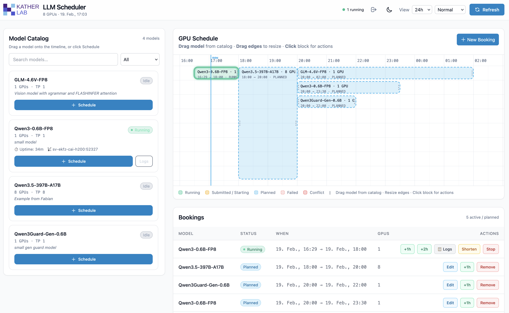

# KatherLab LLM Scheduler

A web-based tool for scheduling and serving large language models (LLMs) on shared GPU servers. Built for research teams, labs, and organizations that need to coordinate access to limited GPU resources across multiple models and users.



---

## What problem does this solve?

If your lab or team has a powerful GPU server (e.g., an 8×H200 HGX node) and multiple people want to run different LLMs at different times, things get messy fast:

- Who's using which GPUs right now?
- Can I run my model without conflicting with someone else's?
- How do I start/stop vLLM without SSH-ing into the server every time?
- How do my scripts and tools connect to the right model endpoint?

**KatherLab LLM Scheduler solves all of this.** Think of it as a **shared calendar for your GPUs** — with automatic model lifecycle management and a built-in OpenAI-compatible API proxy.

---

## Key Features

- 📅 **Visual GPU timeline** — see at a glance what's running, what's planned, and where there's free capacity. Drag-and-drop to create, move, and resize bookings.
- 🚀 **One-click model start** — pick from a pre-configured model catalog, choose a time and duration, and the scheduler handles the rest (Slurm job submission, health checks, routing).
- ⚡ **ASAP booking** — automatically finds the earliest free GPU slot for your model.
- 🔀 **OpenAI-compatible API proxy** — your apps (Open WebUI, LiteLLM, Python scripts, etc.) always connect to **one stable address**. The scheduler routes requests to the correct running model behind the scenes.
- 🔁 **Automatic retries** — if a model fails to start (e.g., OOM), the scheduler retries automatically.
- 📋 **Live Slurm logs** — view stdout/stderr directly from the web UI. No SSH needed.
- ⏱️ **Extend, shorten, or stop** running models from the UI — the scheduler updates the Slurm job time limit accordingly.
- 🔒 **Password-protected access** — simple authentication to keep the UI secure.
- 🏷️ **Model tags** — filter models by capability (e.g., `vision`, `reasoning`).
- 🌙 **Dark mode**

---

## How it works

```
  You (browser)           KatherLab LLM Scheduler            GPU Server (Slurm)
  ┌──────────┐            ┌──────────────────────┐            ┌──────────────────┐
  │  Web UI  │───────────▶│  Scheduler + Router  │───────────▶│  vLLM instances  │
  │          │◀───────────│   (FastAPI app)      │◀───────────│  (Slurm jobs)    │
  └──────────┘            └──────────────────────┘            └──────────────────┘
```

1. **You open the web UI** and see a timeline of GPU usage and a catalog of available models.
2. **You create a booking** — e.g., "Run Qwen3.5-397B from 10:00 to 18:00 on 4 GPUs."
3. **The scheduler submits a Slurm job** that starts vLLM with the right model, GPU allocation, and configuration.
4. **Once the model is healthy**, the scheduler marks it as ready and begins routing API requests to it.
5. **When the booking ends**, the Slurm job is cancelled and the GPUs are freed for the next booking.

---

## Prerequisites

Before setting up the scheduler, make sure you have the following:

### 1. A Linux server with Slurm

The scheduler uses Slurm to manage GPU jobs. You need:

- A working Slurm installation with `sbatch`, `squeue`, `scancel`, and `scontrol` available.
- **`sacct` and `slurmdbd` must be configured and running.** The scheduler uses `sacct` to determine why jobs ended (OOM, timeout, normal completion, etc.) and to decide whether to retry failed jobs. Without `sacct`/`slurmdbd`, the retry and reconciliation logic will not work correctly.
- GPU resources configured in Slurm (e.g., `--gres=gpu:N`).

### 2. GPUs

At least one GPU. The scheduler is designed for multi-GPU servers (e.g., 4×A100, 8×H100) where different models need different numbers of GPUs.

### 3. Python 3.13+

The scheduler itself requires Python 3.13 or newer.

### 4. [uv](https://docs.astral.sh/uv/) (fast Python package manager)

Used to manage the scheduler's own Python environment. Install it with:

```bash
curl -LsSf https://astral.sh/uv/install.sh | sh
```

### 5. A vLLM installation (one or more venvs)

Each model in your catalog points to a Python virtual environment that has vLLM installed. The scheduler launches vLLM via Slurm jobs using the `venv_activate` path specified in the model config.

**You can have multiple vLLM venvs** — for example, different vLLM versions for different models, or a nightly build for models that require bleeding-edge features. Each model entry in `config/models.yaml` specifies which venv to use.

---

## Setting up vLLM

The scheduler does **not** install vLLM for you — it just launches it. You need to prepare one or more virtual environments with vLLM installed.

### Quick setup with uv

```bash
# Create a new venv (e.g., for vLLM stable)
cd /opt/vllm-envs
uv venv --python 3.12 --seed --managed-python
source .venv/bin/activate

# Install vLLM with automatic PyTorch backend detection
uv pip install vllm --torch-backend=auto
```

> **Note:** Some models require specific vLLM versions or extra dependencies. Always check:
>
> - The model's Hugging Face page for recommended vLLM versions and launch arguments.
> - The [vLLM installation guide](https://docs.vllm.ai/en/latest/getting_started/installation/gpu/) for detailed GPU-specific instructions (CUDA versions, flash-attention, etc.).
> - The [vLLM recipes](https://docs.vllm.ai/projects/recipes/en/latest/index.html) for model-specific configurations and optimizations.

### Example: multiple venvs for different models

```bash
# Stable vLLM for most models
mkdir -p /opt/vllm-stable && cd /opt/vllm-stable
uv venv --python 3.12 --seed --managed-python
source .venv/bin/activate
uv pip install vllm --torch-backend=auto

# Nightly vLLM for models requiring latest features
mkdir -p /opt/vllm-nightly && cd /opt/vllm-nightly
uv venv --python 3.12 --seed --managed-python
source .venv/bin/activate
uv pip install -U vllm --torch-backend=auto --extra-index-url https://wheels.vllm.ai/nightly
```

Then reference the appropriate venv in each model's config:

```yaml
models:
  - name: My-Stable-Model
    venv_activate: /opt/vllm-stable/.venv/bin/activate
    # ...

  - name: My-Bleeding-Edge-Model
    venv_activate: /opt/vllm-nightly/.venv/bin/activate
    # ...
```

---

## Quick Start

### 1. Clone the repository

```bash
git clone https://github.com/KatherLab/LLM-Scheduler.git
cd LLM-Scheduler
```

### 2. Install scheduler dependencies

```bash
uv sync
```

This creates a virtual environment and installs all dependencies for the scheduler itself (FastAPI, SQLAlchemy, etc.).

### 3. Configure environment

```bash
cp config/example.env .env
```

Edit `.env` and adjust the following settings:

| Setting | What it does | Example |
|---|---|---|
| `AUTH_PASSWORD` | Password to log into the web UI | `my-secret-password` |
| `PUBLIC_HOSTNAME` | Hostname or IP that users and vLLM jobs use to reach the scheduler | `gpu-server.mylab.org` |
| `ROUTER_PORT` | Port the scheduler listens on | `9000` |
| `TOTAL_GPUS` | Number of GPUs available on the server | `8` |
| `VLLM_API_KEY` | API Key for using the /v1 endpoints | `some-random-string` |
| `SLURM_PARTITION` | Slurm partition to submit jobs to (leave empty for default) | `gpu` |
| `DATABASE_URL` | Path to the SQLite database file | `sqlite:///./router.db` |
| `VLLM_LOG_DIR` | Directory where Slurm job logs are stored | `./logs` |
| `SBATCH_TEMPLATE_PATH` | Path to the Slurm job script template | `./templates/vllm_job.sh` |
| `VLLM_HEALTH_TIMEOUT_SECONDS` | How long to wait for a model to become healthy before marking it failed | `800` |
| `VLLM_MAX_RETRIES` | Number of times to retry a failed model launch | `1` |

### 4. Configure your model catalog

```bash
cp config/models.example.yaml config/models.yaml
```

Edit `config/models.yaml` to list the models you want to make available. Each entry specifies the model path, GPU requirements, vLLM arguments, and which venv to use:

```yaml
models:
  - name: Qwen3-0.6B-FP8           # Display name (also used as --served-model-name)
    model_path: Qwen/Qwen3-0.6B-FP8 # HF model ID or local path
    gpus: 1                          # Number of GPUs required
    tensor_parallel_size: 1          # vLLM tensor parallelism
    cpus: 4                          # CPUs to request from Slurm
    mem: "16G"                       # Memory to request from Slurm
    gpu_memory_utilization: 0.1      # vLLM --gpu-memory-utilization
    reasoning_parser: deepseek_r1    # vLLM --reasoning-parser (optional)
    extra_args: "--max-num-seqs 10 --enforce-eager --max-model-len 2048"
    venv_activate: /opt/vllm-stable/.venv/bin/activate
    tags: [reasoning]                # Tags for UI filtering (optional)
    notes: "Small test model"        # Description shown in UI (optional)
    env:                             # Extra environment variables (optional)
      VLLM_SOME_FLAG: "1"
```

**Key fields:**

| Field | Required | Description |
|---|---|---|
| `name` | ✅ | Unique model name. Used in the UI and as the `model` parameter in API calls. |
| `model_path` | ✅ | Hugging Face model ID (e.g., `Qwen/Qwen3-0.6B-FP8`) or absolute path to a local model directory. |
| `gpus` | ✅ | Number of GPUs the model needs. |
| `tensor_parallel_size` | ✅ | vLLM tensor parallel size (usually equals `gpus`). |
| `venv_activate` | ✅ | Path to the `activate` script of the venv with vLLM installed. |
| `cpus` | Recommended | Number of CPUs to request from Slurm. |
| `mem` | Recommended | Memory to request from Slurm (e.g., `"64G"`). |
| `extra_args` | Optional | Additional vLLM CLI arguments. |
| `tool_args` | Optional | Tool-calling arguments (e.g., `--enable-auto-tool-choice --tool-call-parser hermes`). |
| `reasoning_parser` | Optional | vLLM reasoning parser (e.g., `deepseek_r1`, `qwen3`). |
| `gpu_memory_utilization` | Optional | GPU memory fraction (default: `0.95`). |
| `tags` | Optional | List of tags for filtering in the UI (e.g., `[vision, reasoning]`). |
| `notes` | Optional | Short description shown in the catalog UI. |
| `env` | Optional | Extra environment variables passed to the vLLM process. |

### 5. Run the scheduler

```bash
uv run uvicorn app.main:app --host 0.0.0.0 --port 9000
```

Then open **http://your-server:9000** in your browser and log in with your configured password.

---

## Usage

### Creating a booking via the web UI

1. Open the scheduler in your browser.
2. Browse the **Model Catalog** on the left — you can search, filter by status, or filter by tags.
3. Click **Schedule** on a model, or drag it onto the **GPU timeline**.
4. Choose a start time (Now, ASAP, a specific time) and duration.
5. Click **Create Booking**.

The scheduler will submit a Slurm job, wait for the model to become healthy, and then start routing requests to it.

### Connecting your apps

Once a model is running, send requests to the scheduler's address — it acts as an OpenAI-compatible proxy:

```bash
curl http://your-server:9000/v1/chat/completions \
  -H "Content-Type: application/json" \
  -d '{
    "model": "Qwen3-0.6B-FP8",
    "messages": [{"role": "user", "content": "Hello!"}]
  }'
```

This works with any OpenAI-compatible client, e.g.:

- **Python `openai` library:** set `base_url="http://your-server:9000/v1"`

The scheduler supports the following proxy endpoints:

| Endpoint | Description |
|---|---|
| `POST /v1/chat/completions` | Chat completions (streaming and non-streaming) |
| `POST /v1/responses` | Responses API |
| `POST /v1/messages` | Messages API |
| `POST /v1/audio/transcriptions` | Audio transcription (multipart) |
| `POST /v1/audio/translations` | Audio translation (multipart) |
| `GET /v1/models` | List available models and their status |

### Managing running models

From the web UI, you can:

- **Extend** a running model's booking (+1h, +2h, +4h, or drag the right edge).
- **Shorten** a booking to free GPUs earlier.
- **Stop** a model immediately (cancels the Slurm job).
- **View logs** (stdout/stderr) directly in the browser.
- **Edit notes** on bookings to communicate with your team.

---

## Project Structure

```
├── app/                    # Python backend (FastAPI)
│   ├── main.py             # App entry point, background workers (health, retry, cleanup, reconcile)
│   ├── admin.py            # Booking/lease management API
│   ├── slurm.py            # Slurm integration (sbatch, scancel, scontrol, squeue, sacct)
│   ├── planner.py          # GPU allocation algorithm (lane packing, conflict detection, ASAP search)
│   ├── proxy.py            # OpenAI-compatible request proxy with streaming support
│   ├── router_core.py      # Endpoint selection and health checking
│   ├── catalog.py          # Model catalog loader (auto-reloads on file change)
│   ├── models.py           # SQLAlchemy ORM models (Lease, Endpoint)
│   ├── schemas.py          # Pydantic request/response schemas
│   ├── settings.py         # Configuration (from .env)
│   ├── auth.py             # Session-based authentication
│   ├── db.py               # Database engine setup (SQLite with WAL mode)
│   ├── dependencies.py     # Shared DB session factory
│   ├── lifecycle_logger.py # Structured lifecycle event logging
│   ├── utils.py            # Timezone utilities
│   └── ui/                 # Web frontend (HTML + JS + Tailwind CSS)
│       ├── index.html       # Main scheduler UI
│       ├── login.html       # Login page
│       └── app.js           # Frontend application logic
├── config/
│   ├── models.yaml         # Your model catalog (create from example)
│   ├── models.example.yaml # Example model catalog
│   └── example.env         # Environment variable template
├── templates/
│   └── vllm_job.sh         # Slurm job script template
├── pyproject.toml          # Python project metadata and dependencies
└── README.md               # This file
```

---

## Background Workers

The scheduler runs several background workers that manage the full model lifecycle automatically:

| Worker | What it does |
|---|---|
| **Health worker** | Polls vLLM `/health` endpoints. Detects when models become ready (`STARTING → READY`) or crash (`READY → FAILED`). |
| **Planned submit worker** | Submits Slurm jobs for bookings scheduled in the future, with a configurable lead time. |
| **Endpoint cleanup worker** | Cancels Slurm jobs for expired or cancelled bookings. |
| **Slurm reconcile worker** | Cross-references DB state with Slurm reality (`squeue` + `sacct`). Detects OOM, crashes, and preemptions. |
| **Retry worker** | Automatically resubmits failed jobs (up to `VLLM_MAX_RETRIES` times). |

---

## Troubleshooting

### "sacct: command not found" or sacct returns no data

The scheduler requires `sacct` (Slurm accounting) to determine why jobs ended. Make sure:

- `slurmdbd` is running and configured.
- `AccountingStorageType` is set in your `slurm.conf` (e.g., `AccountingStorageType=accounting_storage/slurmdbd`).
- Test with: `sacct -j <some_job_id> --format=JobID,State,ExitCode --noheader --parsable2`

### Model stuck in "STARTING" state

- Check the Slurm logs via the web UI (click on the booking → "View Logs").
- Common causes: model too large for available GPU memory, missing dependencies in the vLLM venv, incorrect `model_path`.
- The model will be marked as FAILED after `VLLM_HEALTH_TIMEOUT_SECONDS` (default: 800s).

### GPU conflict errors

The scheduler prevents overbooking GPUs. If you see a conflict error, check the timeline for overlapping bookings. You can cancel or shorten existing bookings to free up GPUs.

### Models catalog not updating

The scheduler auto-reloads `config/models.yaml` when the file changes. If changes aren't reflected, try refreshing the browser or restarting the scheduler.

---

## Contributing

Contributions are welcome! Please open an issue or pull request on [GitHub](https://github.com/KatherLab/LLM-Scheduler).

---

## License

MIT — see [LICENSE](LICENSE) for details.