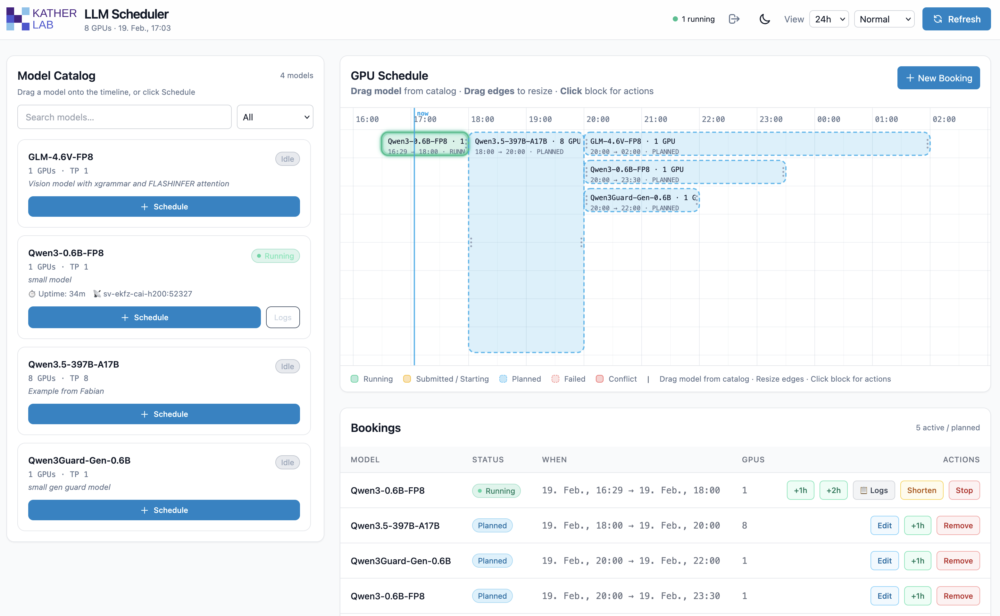

# KatherLab LLM Scheduler

A web-based tool for scheduling and serving large language models (LLMs) on shared GPU clusters. Built for research teams and labs that need to coordinate access to limited GPU resources across multiple models and users.



---

## What problem does this solve?

If your lab has GPU servers and multiple people want to run different LLMs at different times, things get messy fast:

- Who's using which GPUs right now?
- Can I run my model without conflicting with someone else's?
- How do I start/stop vLLM without SSH-ing into a node every time?
- How do my scripts and tools connect to the right model endpoint?

**KatherLab LLM Scheduler solves all of this.** Think of it as a **shared calendar for your GPUs** — with automatic model lifecycle management and a built-in OpenAI-compatible API proxy.

---

## Key Features

- 📅 **Visual GPU timeline** — see what's running, planned, and free across every node. Drag-and-drop to create, move, and resize bookings.
- 🚀 **One-click model start** — pick from a model catalog, choose a time and duration; the scheduler handles Slurm submission, health checks, and routing.
- ⚡ **ASAP booking** and Slurm-backed start estimates when the exact time isn't free.
- 🖥️ **Multi-node, heterogeneous clusters** — different GPU classes (24/48/80/96 GB, different architectures) with per-class runtime images and model variants.
- 🔀 **OpenAI-compatible API proxy** (chat, responses, messages, audio) — apps always connect to **one stable address**; the scheduler load-balances across replicas and routes around draining/failed ones.
- 🔁 **Automatic retries** on failed launches, and rolling zero-downtime renewal for long-lived (`mode: service`) deployments.
- 📋 **Live Slurm logs** and Prometheus metrics, from the web UI — no SSH needed.
- 🧩 **Apptainer image management** — build, list, and delete `.sif` images per GPU architecture from the UI.
- 🔒 **Password or LDAP/FreeIPA authentication**, with role- and pool-based authorization.
- 🏢 **High availability** — multiple router instances with leader election, backed by Postgres.
- 🌙 **Dark mode**

---

## How it works

```
  You (browser)           KatherLab LLM Scheduler                Slurm Cluster
  ┌──────────┐            ┌──────────────────────┐            ┌──────────────────┐
  │  Web UI  │───────────▶│  Scheduler + Router  │───────────▶│  vLLM instances  │
  │          │◀───────────│   (FastAPI app)      │◀───────────│  (Slurm jobs)    │
  └──────────┘            └──────────────────────┘            └──────────────────┘
```

1. **You open the web UI** and see a timeline of GPU usage across nodes and a catalog of available models.
2. **You create a booking** — e.g., "Run Qwen3.5-397B from 10:00 to 18:00 on 4 GPUs."
3. **The scheduler submits a Slurm job via `slurmrestd`** that starts vLLM with the right image, GPU allocation, and configuration.
4. **Once the model is healthy**, it's marked ready and the proxy begins routing requests to it.
5. **When the booking ends**, the Slurm job is cancelled and the GPUs are freed.

See [`docs/architecture-v2.md`](docs/architecture-v2.md) for the full multi-node/multi-tenant design.

---

## Prerequisites

- A Slurm cluster with GPU resources configured (`--gres=gpu:N`) and `slurmrestd` reachable over HTTP.
- A way to obtain a Slurm JWT (`scontrol token`) — see [Token renewal](#token-renewal) below.
- Docker or Podman to run the scheduler container — it needs no Slurm binaries, munge, or host access of any kind.
- One or more Apptainer images with vLLM installed, for the compute nodes to run.

---

## Quick Start

```bash
git clone https://github.com/KatherLab/LLM-Scheduler.git
cd LLM-Scheduler

cp config/example.env .env
cp config/cluster.example.yaml config/cluster.yaml   # optional: multi-node topology
cp config/models.example.yaml config/models.yaml

# Edit .env, config/cluster.yaml, config/models.yaml for your cluster
docker-compose up --build
```

Then open `http://<host>:9000` and log in.

The only network requirements are: this container → `slurmrestd`, this container → compute nodes (proxying to vLLM), and compute nodes → this container (registration).

### Token renewal

`scontrol token` defaults to a 30-minute lifespan, so plan for renewal via `SLURM_TOKEN_MODE`: `file` (a cron/systemd timer refreshes a token file — the scheduler never holds a credential that can mint tokens) or `command` (the scheduler renews it automatically, e.g. over SSH). See `config/example.env` for the full recipe.

---

## Configuration

All settings live in `.env`; the full list with defaults is in `app/settings.py`. The essentials:

| Setting | What it does |
|---|---|
| `AUTH_MODE` | `password` (shared secret) or `ldap` (FreeIPA, with the password as break-glass admin) |
| `SLURM_REST_URL` | Base URL of `slurmrestd`, including its API version (e.g. `http://titan:6820/slurm/v0.0.42`) |
| `PUBLIC_HOSTNAME` | Hostname vLLM jobs use to register back with the scheduler |
| `TOTAL_GPUS` | Fallback GPU count when no `config/cluster.yaml` exists |
| `JOB_LOG_DIR` | Shared filesystem path Slurm writes job stdout/stderr to |
| `VLLM_API_KEY` | API key required on `/v1/*` proxy endpoints |
| `DATABASE_URL` | SQLite (single instance) or Postgres (required for `HA_ENABLED`) |

Two optional YAML files add capability beyond a single flat GPU pool:

- **`config/cluster.yaml`** — node/GPU topology, GPU classes, runtimes (apptainer/venv), pools, and quotas. Without it, the app treats the cluster as one node with `TOTAL_GPUS` untyped GPUs.
- **`config/models.yaml`** — the model catalog: model path, GPU requirements, vLLM args, and which runtime/venv to use, plus an optional `defaults:` block merged into every model. See `config/models.example.yaml` for the full schema.

---

## Usage

### Creating a booking

1. Browse the **Model Catalog**, search/filter by tag or status.
2. Click **Schedule**, or drag a model onto the **GPU timeline**.
3. Pick a start time (Now, ASAP, or specific) and duration, then **Create Booking**.

### Connecting your apps

Send requests to the scheduler's address — it's an OpenAI-compatible proxy:

```bash
curl http://<host>:9000/v1/chat/completions \
  -H "Content-Type: application/json" \
  -H "Authorization: Bearer $VLLM_API_KEY" \
  -d '{"model": "Qwen3-0.6B-FP8", "messages": [{"role": "user", "content": "Hello!"}]}'
```

Works with any OpenAI-compatible client (`base_url="http://<host>:9000/v1"`). Also supports `/v1/responses`, `/v1/messages`, `/v1/audio/transcriptions`, `/v1/audio/translations`, and `/v1/models`.

### Managing running models

From the UI: extend/shorten a booking, stop it early, view live Slurm logs, or edit notes — all without SSH.

---

## Project Structure

```
├── app/                    # FastAPI backend
│   ├── main.py             # Entry point, background workers
│   ├── backends/           # ClusterBackend abstraction (slurmrestd primary)
│   ├── admin.py            # Booking/lease CRUD, dashboard API
│   ├── proxy.py            # OpenAI-compatible request proxy
│   ├── router_core.py      # Endpoint selection, health checks
│   ├── loadbalancer.py     # Least-loaded routing, drain handling
│   ├── placement.py        # Per-(node, GPU) scheduling/placement
│   ├── catalog.py          # Model catalog loader (auto-reloads)
│   ├── cluster.py          # Cluster topology from cluster.yaml
│   ├── images.py           # Apptainer image build/list/delete
│   ├── identity.py         # Auth: password / LDAP
│   ├── authz.py            # Roles and permissions
│   └── ui/                 # Vanilla JS + Tailwind frontend
├── config/                 # example.env, models.yaml, cluster.yaml
├── templates/               # Slurm job + image build script templates
├── docs/                    # architecture-v2.md, metrics.md
├── Dockerfile, compose.yml # Container deployment
└── pyproject.toml
```

---

## Background Workers

The scheduler runs several supervised background workers (see `app/main.py`): inventory refresh, Slurm start-time estimates, rolling service renewal, health polling, planned-job submission, expired-lease cleanup, Slurm state reconciliation, retries, and image build tracking. Each restarts automatically on failure.

---

## Troubleshooting

- **Model stuck in "STARTING"** — check job logs from the UI (booking → View Logs). Common causes: model too large for the GPU class, missing venv/image dependencies, wrong `model_path`. Marked FAILED after `VLLM_HEALTH_TIMEOUT_SECONDS`.
- **"Cluster unavailable"** — the scheduler couldn't reach `slurmrestd` (or its JWT expired). It pauses rather than assuming the cluster is empty; check connectivity and token renewal (`SLURM_TOKEN_MODE`).
- **GPU conflict errors** — the scheduler refuses overlapping bookings on the same GPUs; check the timeline for existing bookings.
- **`config/models.yaml` changes not showing** — it auto-reloads on file change; try refreshing the browser.

---

## Contributing

Contributions are welcome! Please open an issue or pull request on [GitHub](https://github.com/KatherLab/LLM-Scheduler).

---

## License

MIT — see [LICENSE](LICENSE) for details.
